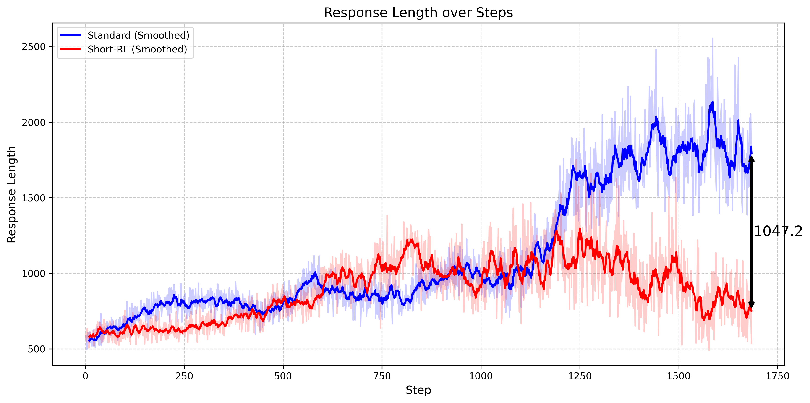
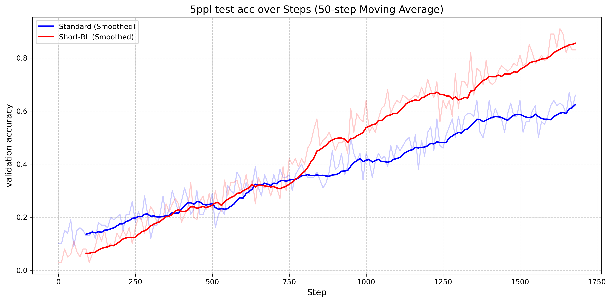

<div align="center">

# Short RL

**Short RL**: Controlling Reasoning Model Training Length Dynamics for better performance.

<div>

</div>
</div>

<div align="center" style="line-height: 1;">
    <a href="https://github.com/lblankl/Short-RL" style="margin: 2px;"></a>
  
  <a href="https://www.notion.so/Short-RL-Controlling-Reasoning-Model-Training-Length-Dynamics-with-better-performance-1b298c6782a281059383edd683ab16c0" target="_blank">
  </a>

</div>

<div>
<br>

</div>



*Figure 1 | The averaged response length curves of Qwen2.5-7B trained on Logic-RL dataset. The red curve represent our Short-RL and the blue curve represent normal RL training method.*


*Figure 2 | The accuracy curves of Qwen2.5-7B on the 5ppl test dataset of Logic-RL. The red curve represent our Short-RL and the blue curve represent normal RL training method.*

## Overview
We intorduce **Short-RL**, a simple yet effective technique to reduce response length during the RL training process of R1-like models, while maintaining stable performance.

## Getting Started 🚀

### Installation & Training Scripts

#### Logic-RL Setup

To begin working with **Short-RL** for the Logic-RL dataset, just run:

```bash
cd Logic-RL
conda create -n logic python=3.9
pip install torch==2.4.0 --index-url https://download.pytorch.org/whl/cu121
pip3 install vllm==0.6.3 ray
pip3 install flash-attn --no-build-isolation
pip install -e .  # For verl integration
pip install wandb IPython matplotlib
```
#### Math-RL Setup

To begin working with **Short-RL** for the ORZMath dataset, just run:

```bash
cd deepscaler
bash setup.sh
```
#### Start Logic-RL Training

We directly use the data from logic-RL at Logic-RL/data/kk/instruct

Train Short-RL

```bash
cd Logic-RL
bash sh/Short-RL.sh # Normal-RL.sh for baseline comparision
```

Evaluate

```bash
bash eval_kk/eval.sh
```

#### Start Math-RL Training

Data preparation: 

You can directly use the data at deepscaler/data/orzmath

Or if you want to prepare it yourself, first you need to download [`curated 57k training data from Orz`](https://github.com/Open-Reasoner-Zero/Open-Reasoner-Zero/tree/main/data) to ./deepscaler/data.
Then run
```bash 
bash ./scripts/data/data.sh
```

Train Short-RL
```bash
cd deepscaler
bash scripts/train/Short-RL.sh # Normal-RL.sh for baseline comparision
```

Evaluation

The evaluation curves can be seen in wandb during training.

Or if you want to evaluate it after training. You can run:

```bash
bash ./scripts/eval/eval_model.sh
```

## Acknowledgements

Our training framework is built on [Logic-RL](https://github.com/Unakar/Logic-RL), [deepscaler](https://github.com/agentica-project/deepscaler), [verl](https://github.com/volcengine/verl) and [ray](https://github.com/ray-project/ray).
- Our model is based on [Qwen2.5-7B](https://huggingface.co/Qwen/Qwen2.5-7B)
- Our math data is from [Open-Reasoner-Zero](https://github.com/Open-Reasoner-Zero/Open-Reasoner-Zero)


## Citation

```bibtex
@misc{Short-RL,
  title={Short RL : Controlling Reasoning Model Training Length Dynamics with better performance},
  author={Danlong Yuan, Tian Xie, Shaohan Huang, Chong Luo, Furu Wei},
  year={2025},
  howpublished={\url{https://github.com/lblankl/Short-RL}},
}
```